# Screen Saver Reverse Engineering

This repo has two parts:

* An analysis of the Windows XP **3D Pipes** screensaver (`sspipes.scr`, v5.1.2600.5512).
* New screensavers that follow the **same Windows screensaver rules** it does.

The full findings are in **[docs/ANALYSIS.md](docs/ANALYSIS.md)**: identity, imports, resources, registry settings, command line, input and exit rules, multi-monitor, preview and password handling, and how the pipes animation works.

| 3D Pipes (Remake) | Ball joints + textured |
|---|---|
| 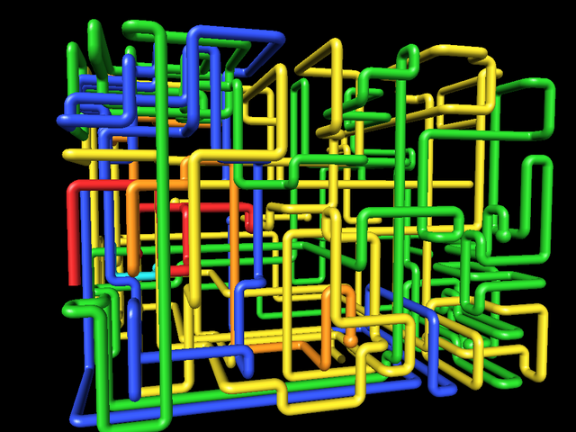 | 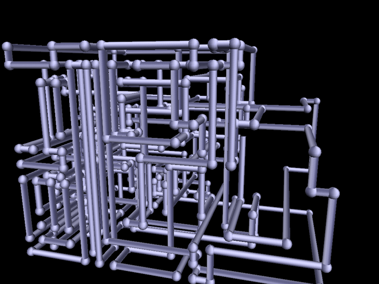 |
| **3D Starfield** | **3D Polyhedra** |
| 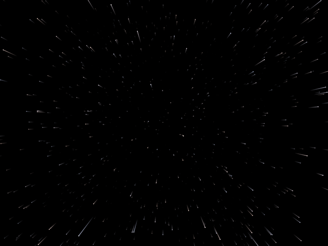 | 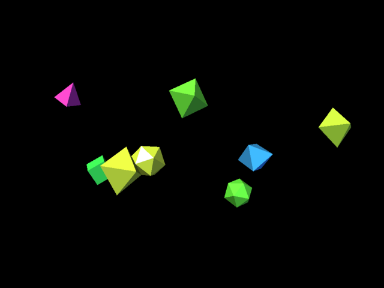 |

## The screensavers

| File | Description | Settings |
|---|---|---|
| `Pipes.scr` | Recreation of 3D Pipes: pipes grow through a 3D grid. | Single/Multiple; Elbow/Ball/Mixed/Cycle joints; Solid/Textured (BMP/JPG/PNG/GIF); Speed |
| `Starfield.scr` | Flying through stars with warp trails. | Colors (White/Tinted/Rainbow); Warp trails; Speed; Density |
| `Polyhedra.scr` | Shiny Platonic solids tumbling and bouncing. | Shape (or Mixed); Number; Motion trails; Speed |
| `Mystify.scr` | Classic Mystify: bouncing polygons with fading echoes. | Shapes 1-4; Colors; Speed; Corners; Echoes |
| `Matrix.scr` | Matrix-style rain of glyph columns. Uses katakana when a Japanese font is installed, otherwise Latin. | Colors; Glyphs (Katakana/Binary/Hex/Latin); Speed; Density; Glyph size |
| `Tunnel.scr` | Flying down an endless winding tube. | Style (Checkerboard/Neon rings/Stripes/Hex plates); Colors; Speed; Twistiness |
| `Ribbons.scr` | Glowing twisting ribbons sweeping through 3D (after Vista/7 Ribbons). | Colors; Speed; Number; Width |
| `Bubbles.scr` | Glassy soap bubbles with rim light and highlights (after Windows 7 Bubbles). | Tint; Speed; Number; Size |
| `Plasma.scr` | Demoscene color plasma. | Palette; Speed; Pattern size |
| `Fireworks.scr` | Rockets bursting into peony, ring, star and two-color shells, with trails. | Colors; Launches; Burst size; Trail length |
| `FlowerBox.scr` | Spinning cube morphing to a sphere and a flower (after XP's 3D Flower Box). | Colors; Shape (Flower/Star/Blob); Spin; Morph speed; Size |

| | |
|---|---|
|  | 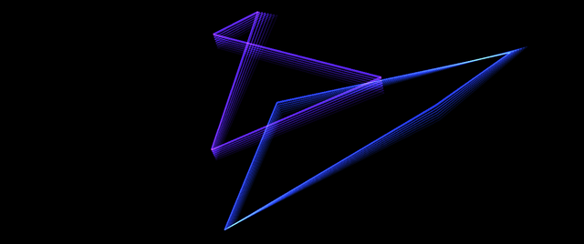 |
| 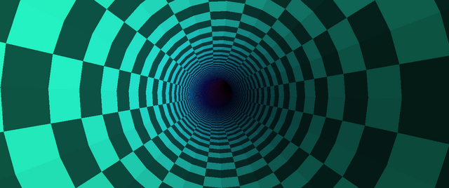 | 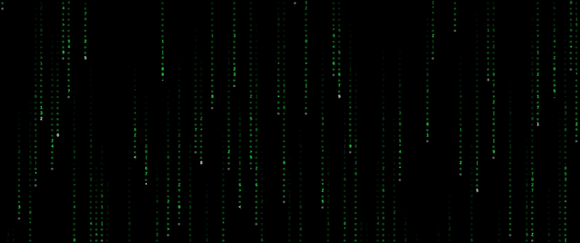 |
| 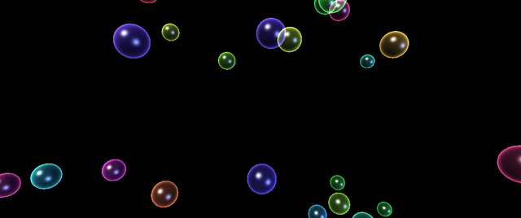 | 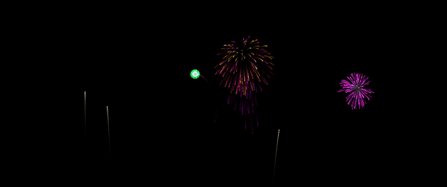 |
| 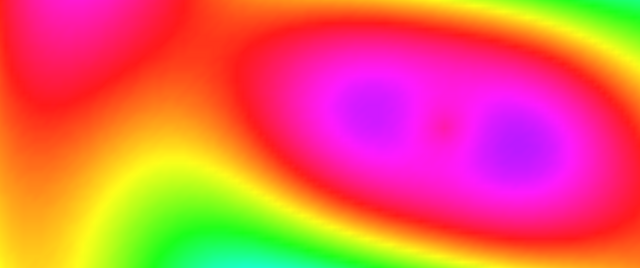 | 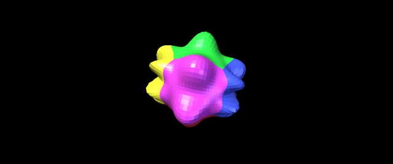 |
| 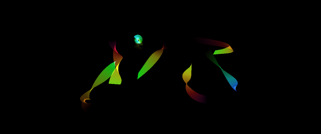 |  |

### Frutiger Aero collection

Glossy glass, aqua and fresh green, bubbles, bokeh and sunlight: the look of Windows Vista and 7. All of these are drawn from procedural textures (`common/aerokit.h`), so they need no image files and stay sharp at any resolution.

| File | Scene | Settings |
|---|---|---|
| `AeroAurora.scr` | Flowing wisps of light over a deep blue-green glow, with drifting bokeh | Palette; Speed; Number of wisps; Bokeh |
| `AeroOrbs.scr` | Glossy gel orbs, like Aero buttons set free, rising through the sky and nudging each other | Orb colors; Background; Speed; Number; Size |
| `AeroMeadow.scr` | Glossy rolling hills, fluffy clouds, turning sun rays and lens flare | Time of day; Lens flare; Wind; Clouds |
| `AeroAquarium.scr` | Sunlit lagoon with light shafts, glossy tropical fish, bubbles and swaying seaweed | Water; Swim speed; Fish; Bubbles |
| `AeroGlassPanes.scr` | Translucent panes of Aero glass with gloss and bright edges drifting in 3D | Glass tint; Backdrop; Speed; Number |
| `AeroBokeh.scr` | Soft out-of-focus lights at different depths, with sparkles | Palette; Speed; Number; Size |

| | |
|---|---|
|  | 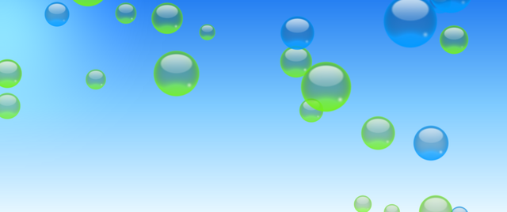 |
| 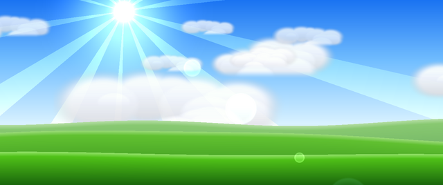 | 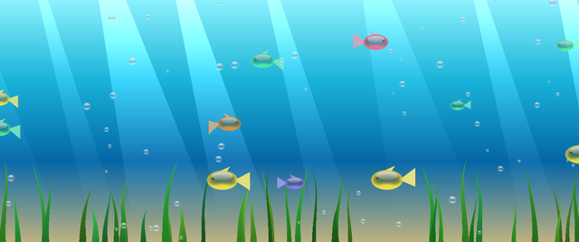 |
| 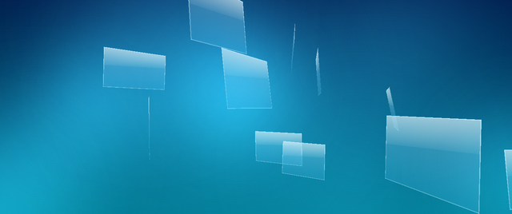 |  |

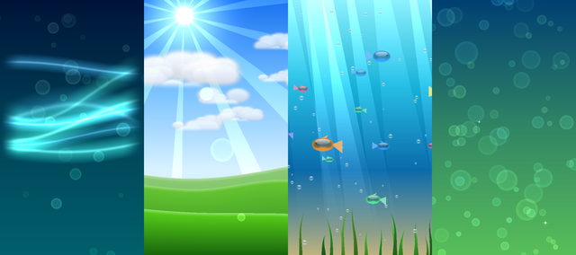

### OLED collection (20 savers)

Made for OLED screens, where a black pixel is fully switched off. Every OLED saver follows the rules in `common/oledkit.h`:
* **Pure black background.** Typically 91–99% of pixels are completely off, and average brightness is about 1% of full white.
* **Sparse light.** Thin glowing lines and small points; never large bright areas.
* **Nothing stands still.** The camera always orbits or drifts, and bright centres (a sun, a nucleus, a galaxy core) wander around the screen, so no element sits on the same pixels (no burn-in).
* **Brightness slider in every saver** to cap peak brightness (default 70%).
* **Smooth, time-based fades** (the Matrix technique) and constant-pixel-width anti-aliased lines at any resolution.

| File | Scene |
|---|---|
| `OLED_Lorenz.scr` | Tracers drawing the Lorenz "butterfly" attractor |
| `OLED_WireGlobe.scr` | Rotating wireframe Earth with glowing arcs between cities |
| `OLED_DNA.scr` | Turning double helix of glowing bases |
| `OLED_Galaxy.scr` | Thousands of stars wheeling in spiral arms |
| `OLED_Atom.scr` | Electrons racing round a nucleus with light trails |
| `OLED_Tesseract.scr` | 4D hypercube rotating through the fourth dimension |
| `OLED_SynthGrid.scr` | Gliding over endless neon wireframe mountains |
| `OLED_Fountain.scr` | Fountain of sparks arcing and bouncing |
| `OLED_Lissajous.scr` | 3D Lissajous knots morphing smoothly into new shapes |
| `OLED_TorusKnot.scr` | Torus knots cross-fading into new knots |
| `OLED_Plexus.scr` | Drifting points linking up when close |
| `OLED_Fireflies.scr` | Fireflies drifting and blinking softly |
| `OLED_WaveGrid.scr` | Field of dots rippling with interfering waves |
| `OLED_GyroRings.scr` | Nested gyroscope rings with racing beads |
| `OLED_Swarm.scr` | Flock of glowing birds with short trails |
| `OLED_SolarSystem.scr` | Planets and moons around a softly glowing sun |
| `OLED_Spirograph.scr` | Pen tracing ever-changing 3D spirograph loops |
| `OLED_Ripples.scr` | Raindrops landing on dark water |
| `OLED_Lightning.scr` | Branching lightning bolts flashing out of the dark |
| `OLED_Accretion.scr` | Black hole swallowing a swirling disk of matter |

Settings in each: Colors (Cyan, Magenta, Amber, Green, Ice blue, Rainbow, White), Speed, Brightness, plus one saver-specific slider (tracers, arcs, twist, stars, …).

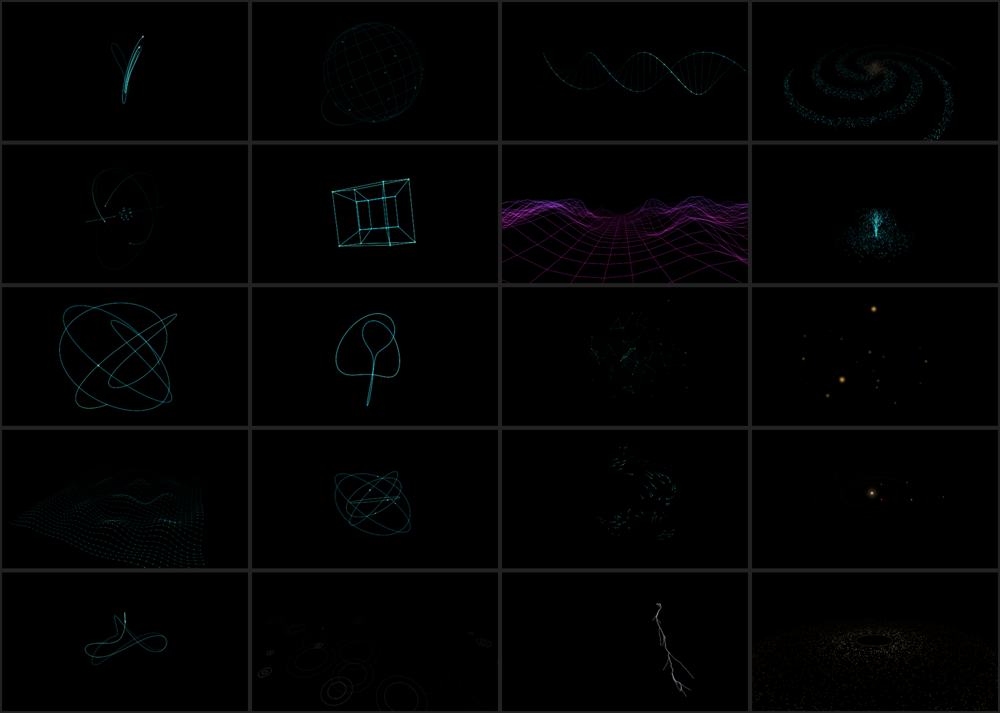

### OLED-safe full-screen collection (20 savers)

These fill the whole screen with colour but still protect an OLED panel: every pixel gets to rest, and nothing stays lit and still. The protection lives in `common/restkit.h` and runs around every scene:

1. **Burn-in guard.** A few times a second the GPU shrinks the frame to a tiny (≤ 64×64) snapshot that the CPU reads back without stalling. For every region the guard tracks average brightness and how much it changes. A region that stays **bright and static for about 45 seconds is dimmed in place**, smoothly, until it changes again. If a fifth of the screen goes static, a full rest starts early.
2. **Scheduled rest to black.** Every *N* minutes (1–15, default 5) the scene fades to complete black, rests (5–60 s, default 15 s), and returns as a **new variation**: new colours, camera and layout.
3. **Rolling rest band** (optional, Off / Subtle / Strong). A soft dark band slowly sweeps the screen in changing directions.
4. **Pixel orbit.** The whole image shifts a few pixels round a slow circle, so even hard edges never sit on exactly the same pixels.

Test result under Wine: a deliberately static white block (registry value `BurnInTest` = 1) was dimmed from 92% to 26% brightness, while the moving scene around it was untouched:

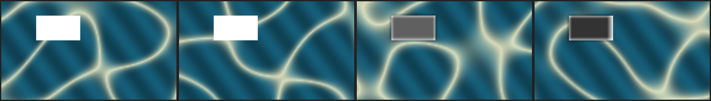

| File | Scene |
|---|---|
| `Safe_Ocean.scr` | Gliding over rolling, sunlit ocean swells (morning, midday, sunset, moonlit) |
| `Safe_CloudFlight.scr` | Flying through soft sunlit clouds |
| `Safe_LavaLamp.scr` | Glowing wax blobs rising, merging and sinking |
| `Safe_NorthernLights.scr` | Aurora curtains over snowy mountains under turning stars |
| `Safe_Kaleidoscope.scr` | Ever-turning mirrored patterns (6–16 mirrors) |
| `Safe_Voronoi.scr` | Living stained-glass cells (GPU Voronoi) |
| `Safe_FlowField.scr` | Thousands of particles painting silky currents |
| `Safe_NeonCity.scr` | Flying over an endless night city of glowing windows |
| `Safe_Nebula.scr` | Drifting through glowing interstellar gas |
| `Safe_Caustics.scr` | Rippling sunlight on a sandy sea floor |
| `Safe_Dunes.scr` | Gliding over golden dunes in low sunlight |
| `Safe_RainyWindow.scr` | Raindrops trickling over blurred city lights |
| `Safe_LowPoly.scr` | Flat-shaded pastel mountains and valleys |
| `Safe_InkSwirls.scr` | Coloured ink curling through clear water |
| `Safe_RetroSunset.scr` | 80s synthwave sunset over a racing neon grid |
| `Safe_Sakura.scr` | Cherry blossom petals over spring hills |
| `Safe_SnowyNight.scr` | Snow over moonlit pine hills |
| `Safe_Harmony.scr` | Glossy flowing bands of colour |
| `Safe_HexPulse.scr` | Hexagonal pillars rising and falling in waves |
| `Safe_Wormhole.scr` | Falling through a swirling wormhole |

Settings in each: a palette or time-of-day choice, Rolling rest band, Speed, one saver-specific slider, Rest to black every (1–15 min), and Rest length (5–60 s).

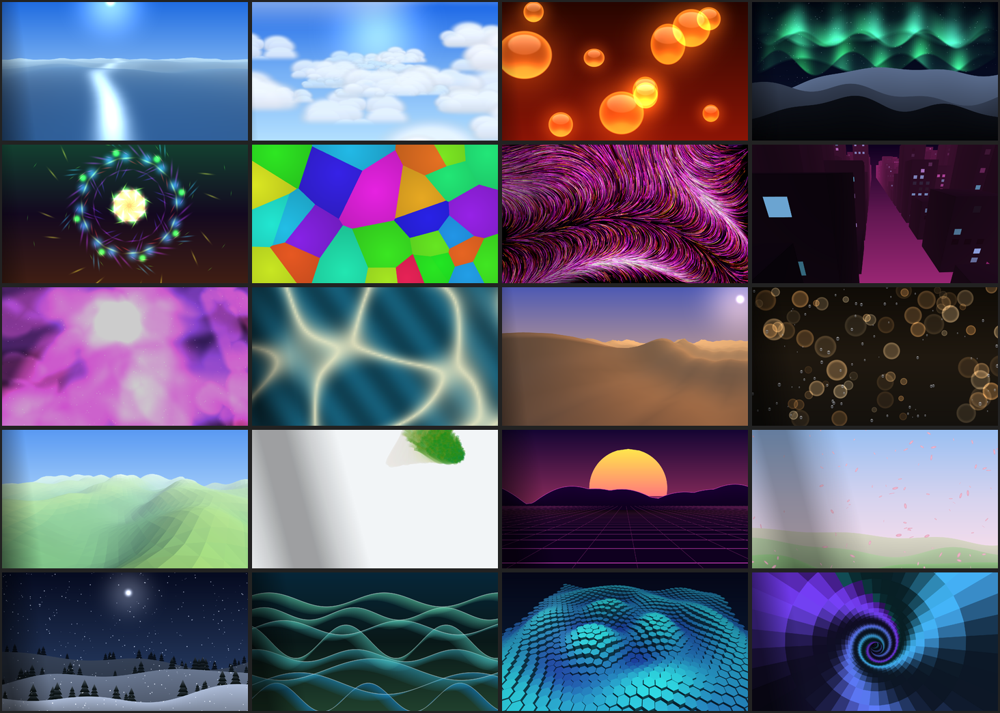

Portrait screens get their own layout (shown here: Matrix, Tunnel, Bubbles, Flower Box):

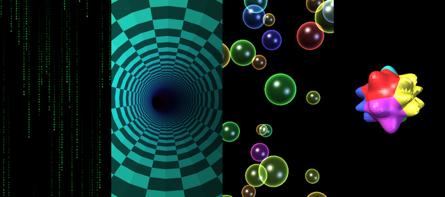

**Image quality:**
* The savers are per-monitor DPI aware, so every monitor renders at its native resolution whatever its Windows scaling.
* They draw with 4x multisample anti-aliasing by default. Choose Off, 2x, 4x or 8x under *Display Settings → Anti-aliasing*.
* Generated textures (orbs, bokeh, clouds, glyphs) are 512 px (glyphs 128 px), so they stay crisp at 4K.

Every saver has a **Display Settings...** button. It lets you pick, per monitor, whether to show the saver or nothing, and whether every monitor shows the same animation. It also has an optional frame-time graph.

## Screensaver Studio and styles

**`bin/ScreensaverStudio.exe`** is a standalone app for trying the savers without installing anything. Keep it in the same folder as the `.scr` files and run it.

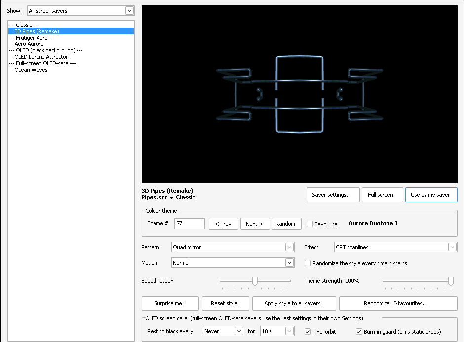

* The list on the left shows every `.scr` in the folder, grouped as Classic, Frutiger Aero, OLED and Full-screen OLED-safe.
* The live preview is the saver itself, started the way Windows starts its preview (`/p`).
* Any style change is saved and the preview restarts with it.
* **Saver settings...** opens the saver's own settings dialog. **Full screen** runs it for real; any input ends it. Double-clicking a saver does the same.
* **Use as my saver** makes the selected `.scr` your Windows screen saver from where it is.
* **Surprise me!** picks a random style. **Apply style to all** sets the current style on every saver.

**Every `.scr` has the full Studio editor built in**, with its own live preview. Open it from *Settings → Themes & Effects...* (or *Display Settings → Themes & Effects...* in Pipes, Starfield and Polyhedra). Changes are saved straight away.

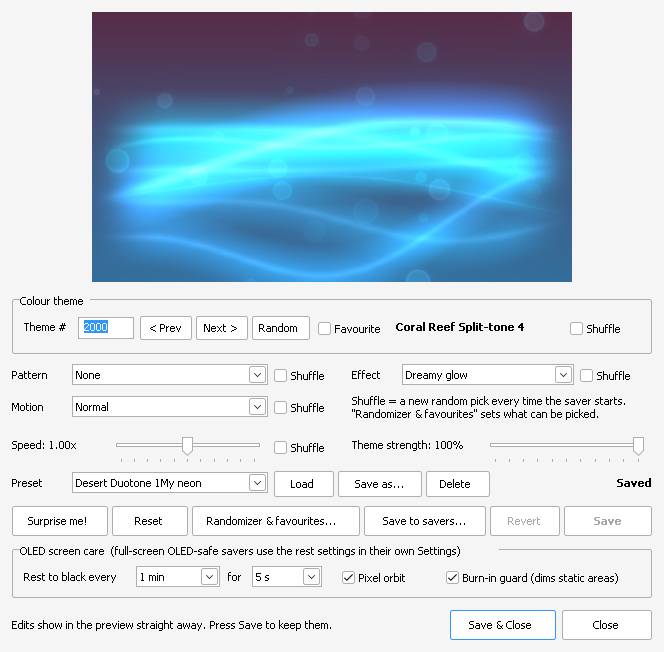

### Randomizer and favourites

* Tick **Randomize the style every time it starts** and the saver picks a new theme, pattern, effect, motion and speed each time Windows starts it. **Apply style to all savers** turns this on for every saver at once.
* Tick **Favourite** next to a theme to add it to your favourites.
* **Randomizer & favourites...** controls what the randomizer can pick. The *Random* and *Surprise me!* buttons follow the same rules.
  * Each palette, theme style, pattern, effect and motion has a tickbox. Untick anything you never want to see.
  * Choose which of theme, pattern, effect, motion and speed get randomized. Anything not randomized keeps the saver's own setting.
  * Limit themes to your favourites, and choose whether the original colours can come up.
  * Set the slowest and fastest random speed.
  * Manage the favourites list.

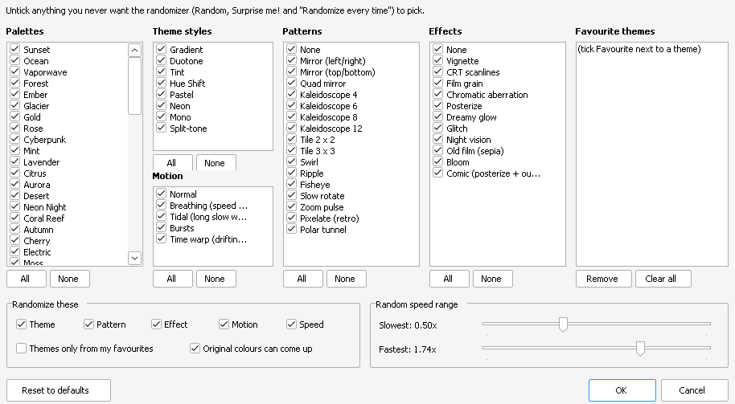

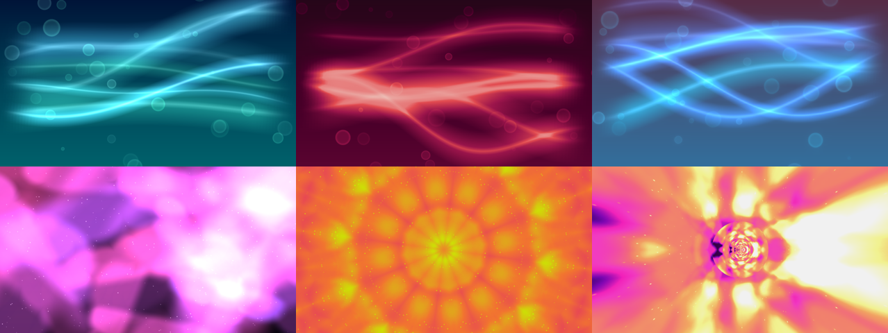
*Top: Aero Aurora with its original colours, theme 5 and theme 2000 with Dreamy glow. Bottom: Nebula with its original colours, theme 4123 with Kaleidoscope 12, and theme 7000 with Polar tunnel and Bloom.*

The style options are:

* **10,240 colour themes.** They combine 64 named palettes (Sunset, Vaporwave, Ocean, Sakura, Terminal...) with 8 ways of applying them and 20 variations each. Theme 0 keeps the saver's original colours. The ways of applying a palette are Gradient map, Duotone, Tint, Hue shift, Pastel, Neon, Mono and Split-tone. A strength slider blends the theme with the original colours.
* **17 patterns:**
  * Mirror left/right, Mirror top/bottom and Quad mirror
  * Kaleidoscope 4, 6, 8 and 12
  * Tile 2×2 and 3×3
  * Swirl, Ripple and Fisheye
  * Slow rotate and Zoom pulse
  * Pixelate (retro) and Polar tunnel
* **12 effects:**
  * Vignette, CRT scanlines and Film grain
  * Chromatic aberration and Glitch
  * Posterize and Comic (posterize + outlines)
  * Dreamy glow and Bloom
  * Night vision and Old film (sepia)
* **Speed** runs from 0.1× to 4× (the middle is 1×).
* **Motion styles** keep varying the speed:
  * Breathing: speed pulses every 6 s.
  * Tidal: long, slow 40 s waves.
  * Bursts
  * Time warp: the speed drifts.

The renderer applies all of this on the GPU in a single full-screen pass over the finished image. That costs well under a millisecond, and nothing is added when the style is left at its defaults. Themes keep true black black, so the OLED savers still leave unused pixels off.

The randomizer settings and favourites are shared by every saver and live in `Styles\_Random`. Styles are stored under `HKCU\Software\ScreenSaverRE\Styles\<saver file name>`. **Apply to all** also writes `Styles\_All`, which any saver without a style of its own uses.

## Rules every saver follows (same as `sspipes.scr`)

* `/s` runs full screen with one top-most window per monitor and the cursor hidden.
* `/p HWND` (or `/l`) draws a live preview inside the Display Properties dialog. It shows "No preview available" on failure.
* No arguments, or `/c[:HWND]`, opens the settings dialog. `/a HWND` changes the password on Windows 9x.
* Any key, mouse button or wheel input ends the saver. So does real mouse movement: more than 5 moves, so jitter doesn't end it. It also ends on losing focus or system suspend.
* `SC_SCREENSAVE` is swallowed so a second saver doesn't start. Monitor power-off still works.
* On Windows 9x it checks the password (`PASSWORD.CPL`) and sets `SPI_SETSCREENSAVERRUNNING`.
* String #1 holds the name shown in Windows. Icon #101, a version resource, and a Common Controls 6 manifest are included.
* Settings are saved per user in the registry under `HKCU\Software\ScreenSaverRE\<Name>`. The value names are the originals' (`Speed`, `Joint Type`, `MultiPipes`, `Textured`, `Texture Name`, `Screen N\Leave Black`, `AllScreensSame`, ...).

Each monitor renders on its own thread at its own refresh rate. Mixed setups (for example 3440×1440 @ 175 Hz plus a portrait 2160×3840 @ 60 Hz, each on its own GPU) stay smooth on every screen. Animation speed doesn't depend on frame rate.

The savers render with **Direct3D 11** (the original used Direct3D 8) and run on Windows 10 and 11. Like the original, each monitor gets its own Direct3D device, created on the graphics card that monitor is plugged into. Each monitor presents with a flip-model swap chain synced to its own refresh rate. Nothing is copied between GPUs and no monitor waits for another.

## Building

On Linux with MinGW-w64 (`apt install g++-mingw-w64-x86-64`), or with MSYS2 on Windows:

```sh
make            # -> build/*.scr, one per saver (64-bit)
make ARCH=x86   # 32-bit build
                # also builds build/ScreensaverStudio.exe
```

## Installing

Prebuilt 64-bit binaries are in `bin/`.

Copy a `.scr` to `C:\Windows\System32`. Then choose it in **Screen saver settings**. You can also right-click the `.scr` file and choose **Install**, or **Test** to run it right away.

## Layout

```
common/           shared framework: WinMain, command line, windows, input rules,
                  per-monitor render threads, registry, Display Settings dialog, common resources
                  render.cpp: Direct3D 11 renderer (one device per monitor, on its own GPU)
                  theme.h: themes, patterns, effects, motion, speed, randomizer (shared with the Studio)
                  styleui.h: the style editor, Themes & Effects window and Randomizer dialog
studio/           Screensaver Studio (standalone browser and live previewer)
savers/<name>/    each saver: scene + settings dialog (.cpp), resources (.rc, .ico)
tools/            pe_inspect.py (analysis), make_icons.py (icon generator)
docs/             ANALYSIS.md + screenshots
```

### Adding a new saver

1. `python3 tools/new_saver.py <name> "<Display Name>" "<Description>"` writes the resource files and adds the saver to the Makefile.
2. Write `savers/<name>/<name>.cpp`. Implement `RegistryName()`, `LoadSettings()`, `ShowConfigDialog()` and `CreateScene()` (see `common/saver.h`).
   * Most savers describe their settings in a `SimpleConfig` (`common/simplecfg.h`), which builds the settings dialog automatically.
   * Use `common/scenekit.h` for colors, quads and 2D drawing.
   * `savers/mystify/mystify.cpp` is a compact example.
3. Add an icon function to `tools/make_icons.py`, then run `make`.
